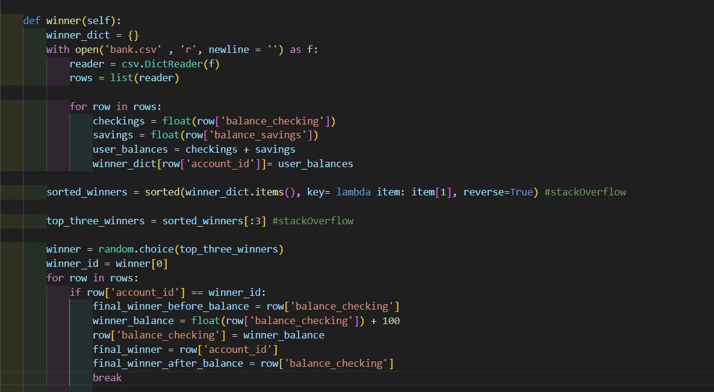
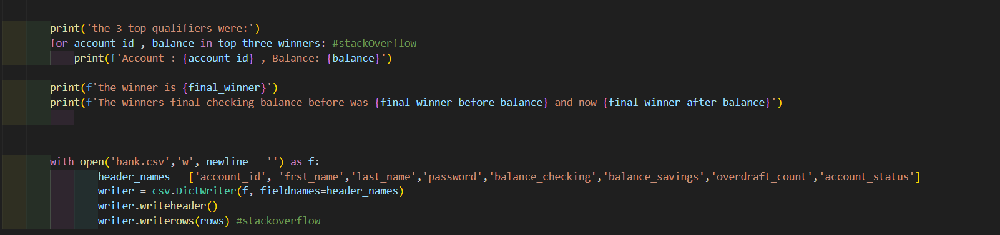

# Bank System

This project is a simple bank system that includes adding customers,logging into your account, depositing, withdrawing, transferring, and many more methods.

## Code I am proud of
This is a method for finding Top 3 Customer Rewards. First I created a dict with all the customers account id's and
their total balance(checkings + savings). Then I sorted it in a descending order. assigned a variable containing only the first three. After that I used random to randomly choose one of the 3 customers. Then I added a 100 as the prize to the winner's checking account, finally I printed the 3 top qualified winners, with showing who won.

# What I learned 

This project helped me a lot with understanding the concept of python, how to think, and how to solve the requirements.
I also learned how to structure my project, and how to test what I wrote to make sure it's working as expected.
I learned how to read from a csv file and how to write and append. 
I still have a lot to improve, but I'm on the right track and still learning to be better.
